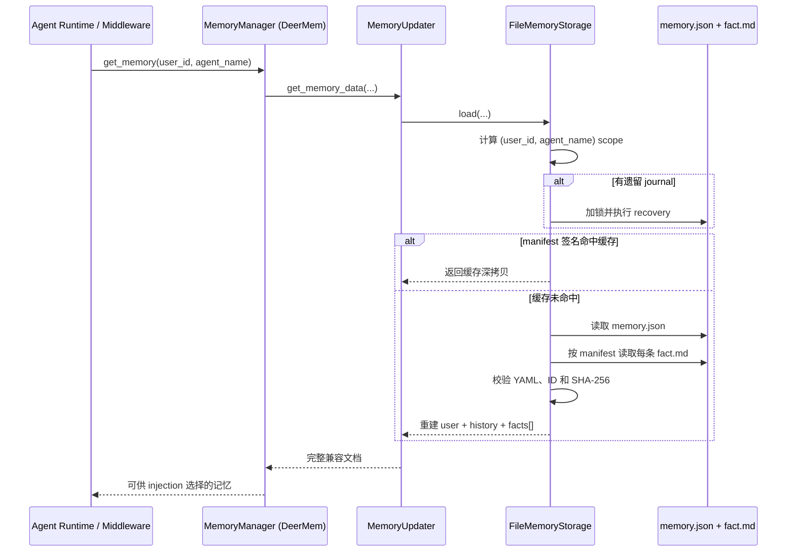
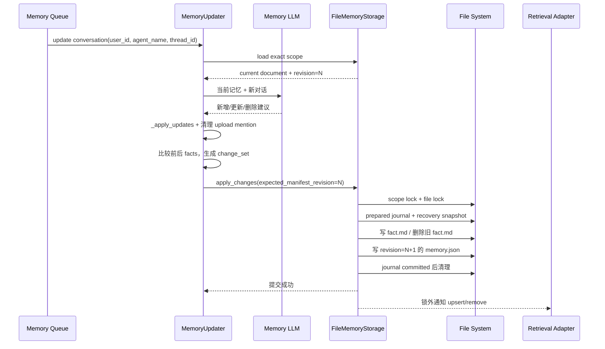
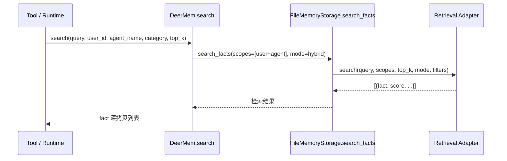
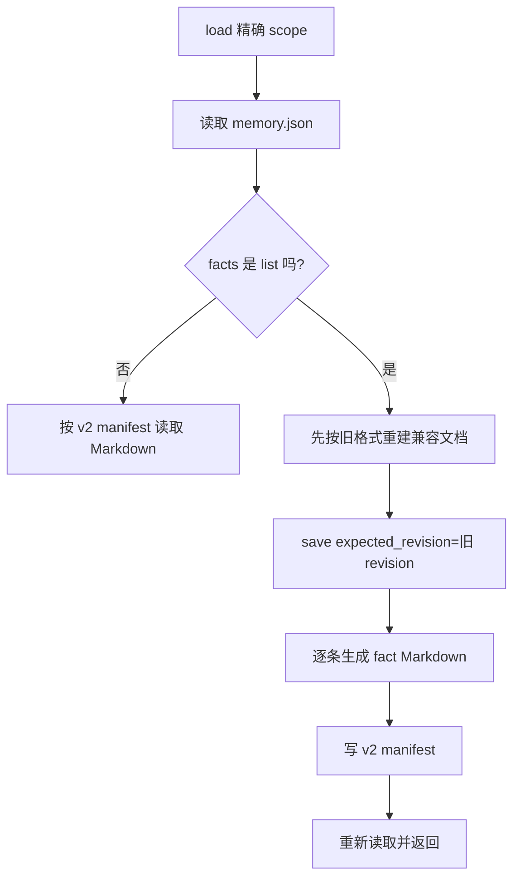

# DeerMem Storage 改写实施说明：从代码差异到完整运行轨迹

> 对比基线：DeerFlow 官方 `upstream/main`，提交 `bc6f1adc`<br>
> 本分支的实现代码提交：`factmd-memory@7f7be5af`<br>
> 阅读对象：第一次接触 DeerFlow、Python 后端或存储系统的同学<br>
> 本文目的：解释本分支相对官方主线改了哪些地方、为什么改，以及代码运行时到底会经过哪些步骤。

---

## 1. 先用一句话理解这次改动

官方主线把一整个 scope 的摘要和全部 facts 都放在一个 `memory.json` 中。本分支改成：

- `memory.json` 只保存摘要、总 revision 和 fact 文件目录；
- 每一条 fact 单独保存成带 YAML 头的 Markdown 文件；
- 旧代码仍然可以像以前一样读取一个含 `facts: []` 的完整 Python dict；
- 写入时增加 scope 锁、跨进程文件锁、revision 冲突检测和崩溃恢复 journal；
- storage 提供单 fact repository 接口，并给未来的独立检索模块留下 adapter 接口。

这次**没有增加 project scope**。真正参与长期记忆分库的维度仍然只有：

```text
MemoryScope = (user_id, agent_name)
```

`thread_id` 只是“这条事实来自哪次对话”的来源信息，写进 `source.threadId`，不会生成新的存储目录。

---

## 2. 初学者词汇表

| 名词 | 在本文中的意思 |
|---|---|
| scope | 一份记忆属于谁。当前由 `user_id + agent_name` 决定 |
| fact | 一条独立的长期记忆，例如“用户喜欢简洁回答” |
| summary | `user` 和 `history` 下的概括性文字，不是单条 fact |
| canonical storage | 最终可信的数据源。新版本中 fact 的最终可信内容是 `.md` 文件 |
| manifest | `memory.json` 中的 fact 目录，记录每个 fact 在哪里、revision 和 hash 是什么 |
| revision | 单调递增的版本号，用来发现“我拿旧版本覆盖了别人刚写的新版本” |
| optimistic lock | 写入前比较 revision；一致才写，不一致就拒绝，而不是一直占着锁 |
| journal | 多文件写入过程的操作记录。程序崩溃后依据它决定回滚还是保留新版本 |
| repository API | 针对事实的 `get/list/upsert/delete/apply_changes` 接口，而不是只会整份 JSON 读写 |
| adapter | storage 与外部检索模块之间的转接对象 |
| fallback | 没有接入外部检索时使用的简单备用方案；这里是 substring 字符串包含匹配 |

---

## 3. 官方主线原来怎样工作

官方主线的 File storage 核心可以概括为：

```text
调用者读取 memory.json
        ↓
得到 user + history + facts[]
        ↓
在内存中修改整个 dict
        ↓
把整个 dict 写入临时 JSON
        ↓
replace 原 memory.json
```

这种方式简单，但存在几个问题：

1. 检索模块若只想索引一条 fact，也要先理解和读取整个大 JSON。
2. storage 只有整文档 `load/save`，无法自然表达单条 fact 的增删改。
3. 临时文件加 `replace` 只能防止“文件只写了一半”，不能防止两个 worker 同时基于旧版本写入造成 lost update。
4. 调用者可能修改 storage 缓存返回的原始 dict，导致“还没保存，缓存已经变了”。
5. JSON 损坏如果被当成空记忆，下一次保存可能把原数据覆盖掉。
6. 将来接入 BM25、向量检索或其他检索服务时，没有清晰的索引生命周期接口。

新实现是在不立即引入 SQLite 的前提下，解决或缓解这些问题。

---

## 4. 新的磁盘布局

假设：

```text
storage_path = D:/deerflow-memory-data
user_id = alice
agent_name = research-agent
fact_id = fact_123456
```

磁盘目录是：

```text
D:/deerflow-memory-data/
└── users/
    └── alice/
        ├── memory.json                       # alice 的公共 agent 层
        ├── facts/
        │   └── fa/
        │       └── fact_public.md
        └── agents/
            └── research-agent/
                ├── memory.json               # alice + research-agent 的精确 scope
                ├── .memory.lock              # 跨进程锁文件
                ├── facts/
                │   └── fa/
                │       └── fact_123456.md
                └── .recovery/                # 写入过程中才可能短暂存在
```

说明：

- fact ID 的前两位作为分片目录，例如 `fact_123456` 会进入 `facts/fa/`。这样可避免几万条 fact 全堆在同一个目录。
- `agent_name` 会沿用官方代码的校验规则并转成小写目录名。
- `project` 不参与目录结构。
- `thread_id` 不参与目录结构。
- 没传 `user_id` 且 `strict_user_scope=false` 时，仍保留官方 legacy 全局目录行为。

### 4.1 一条 fact 的 Markdown 示例

```markdown
---
id: fact_123456
schemaVersion: 2
category: preference
topics:
  - response-style
confidence: 0.9
status: active
createdAt: '2026-07-17T08:00:00Z'
updatedAt: '2026-07-17T08:00:00Z'
revision: 1
source:
  type: conversation
  threadId: thread_789
user_id: alice
agent_name: research-agent
consolidatedFrom: []
---

# 用户偏好简洁回答

用户希望回答先给结论，再给必要说明。
```

为什么标题和正文没有放进 YAML：

- 一级标题方便人直接打开文件浏览；
- 正文是事实本身，适合 Markdown reader、分块器或全文检索器读取；
- 结构字段仍在 YAML 中，检索模块可以稳定解析 category、topics、scope 和 source。

### 4.2 `memory.json` 示例

```json
{
  "version": "2.0",
  "revision": 8,
  "lastUpdated": "2026-07-17T08:00:00Z",
  "user": {
    "workContext": {"summary": "用户正在改造记忆插件", "updatedAt": "..."}
  },
  "history": {
    "recentMonths": {"summary": "近期研究 RAG", "updatedAt": "..."}
  },
  "facts": {
    "fact_123456": {
      "path": "facts/fa/fact_123456.md",
      "revision": 1,
      "contentHash": "sha256:..."
    }
  }
}
```

这里的 `facts` 不再包含完整正文。它像一本书的目录：告诉 reader 去哪个 `.md` 文件读取，并用 hash 检查文件是否被意外改变或损坏。

---

## 5. 本分支相对 `upstream/main` 的全部文件差异

一共涉及 12 个文件。下面逐个说明。

## 5.1 `core/storage.py`：核心改写

路径：

```text
backend/packages/harness/deerflow/agents/memory/backends/deermem/deermem/core/storage.py
```

这是本次改动最大、最重要的文件。官方主线的 File storage 被扩展成“Markdown fact + JSON manifest repository”。

### A. 新增依赖和常量

新增的标准库主要用于：

- `copy`：返回深拷贝，防止调用者污染缓存；
- `hashlib`：为每个 Markdown 文件计算 SHA-256；
- `importlib`：按 dotted path 加载 storage 或 retrieval adapter；
- `shutil`：制作和清理 recovery 快照；
- `threading`：同进程、同 scope 的锁；
- `uuid`：生成 fact ID、journal operation ID 和临时文件名；
- `yaml`：读写 Markdown 顶部的 YAML front matter。

新增常量：

- `DOCUMENT_VERSION = "2.0"`：磁盘 manifest 格式版本；
- `CORE_CATEGORIES`：核心枚举类别集合。

核心类别为：

```text
preference / correction / context / goal / behavior /
identity / constraint / decision / other
```

不认识的旧类别不会丢弃，而会被转换为：

```text
category = other
categoryExtension = 原类别
```

这就是“核心枚举 + 扩展类别”的实现。

### B. 新增三个异常类型

| 异常 | 什么时候出现 | 为什么不直接返回空记忆 |
|---|---|---|
| `MemoryStorageError` | storage 持久化通用错误 | 给上层一个统一错误父类 |
| `MemoryStorageCorruption` | JSON、Markdown、journal、ID 或 hash 无法可信解析 | 返回空记忆可能导致下一次保存覆盖原文件 |
| `MemoryRevisionConflict` | 写入者拿着旧 manifest revision | 必须明确拒绝 lost update |

### C. 新增 `RetrievalPort`

这是 storage 对检索同事要求的最小接口：

```text
upsert(fact, scope, path)
remove(fact_id, scope)
search(query, scopes, top_k, mode, filters)
```

storage 不在这里实现 embedding、BM25、向量库、MMR 或 rerank。它只在 fact 提交成功后通知 adapter，并把搜索请求转交给 adapter。

### D. 新增和修改的数据辅助函数

#### `utc_now_iso_z()`

统一生成 UTC 的 ISO 时间，例如 `2026-07-17T08:00:00Z`。

#### `create_empty_memory()`

继续返回旧调用者熟悉的完整文档形状：

```text
user + history + facts[]
```

这里仍把兼容对象的 `version` 初始化为 `1.0`；第一次真正保存后，磁盘 manifest 会写成 `2.0`。

#### `_scope_dict()`

把散落参数转换为 fact 内的结构：

```json
{"userId": "alice", "agentName": "research-agent"}
```

#### `_content_hash()`

计算 Markdown 原始 bytes 的 SHA-256，写入 manifest。读取时重新计算并比较。

#### `_file_signature()`

缓存失效标记从官方主线的单一 mtime 改成：

```text
(纳秒级 mtime, 文件大小)
```

理由是只看秒级时间更容易漏掉短时间连续写入。它仍不是内容 hash；它只用于快速判断 manifest 是否变化。

#### `_normalize_category()`

落实“核心枚举 + 扩展类别”，未知类别进入 `categoryExtension`。

#### `_normalize_fact()`

每次持久化前统一 fact：

- 没有 ID 时生成内部 ID；
- 强制 `schemaVersion=2`；
- 去除正文首尾空白；
- category 归一化；
- confidence 非数字、非有限数或不在 0～1 时回退为 `0.5`；
- 强制当前可读状态为 `active`；
- 把当前 `user_id/agent_name` 写进 fact；
- 补 `createdAt/updatedAt`；
- 补 `revision`，最小为 1；
- 把旧字符串 `source` 转成结构化对象；
- 补 `topics` 和 `consolidatedFrom`。

注意：当前代码真正用于并发冲突检测的是 **manifest revision**。fact 中的 `revision` 已持久化，但本实现没有在每次更新时自动递增它，也没有独立比较 fact revision。

#### `_fact_title()`

优先使用显式 `title`；没有 title 时，用正文第一行生成标题，最长 160 个字符并去掉换行。

#### `_render_fact_markdown()`

把 fact 转成 UTF-8 Markdown：

- `content/title` 写到 Markdown 可读部分；
- 其他字段写进 YAML；
- `scope.userId/agentName` 在文件中展开为 `user_id/agent_name`。

#### `_parse_fact_markdown()`

执行反向解析：

- 要求文件以 `---` YAML 头开始；
- YAML 必须是对象；
- 读取一级标题；
- 其余部分作为 content；
- `user_id/agent_name` 重新组成 scope；
- 编码、YAML 或格式错误统一抛 `MemoryStorageCorruption`。

#### `_atomic_write()`

单文件写入步骤：

```text
创建同目录临时文件 → 写 bytes → flush → fsync → replace 正式文件
```

它保证不会让 reader 看到半个文件，但它单独并不能解决多个 writer 的覆盖问题，所以还需要后面的锁、revision 和 journal。

#### `_process_file_lock()`

增加跨进程 advisory lock：

- Windows 使用 `msvcrt.locking`；
- Linux/macOS 使用 `fcntl.flock`；
- 每 50ms 重试一次；
- 超过 `file_lock_timeout_seconds` 抛 `TimeoutError`；
- 锁粒度是一个 scope 目录中的 `.memory.lock`。

这是单机本地文件系统锁，不是分布式锁。

### E. 扩展 `MemoryStorage` 接口

官方接口原本主要是：

```text
load / reload / save
```

本分支对 `save` 增加可选 `expected_revision`，并新增默认抛 `NotImplementedError` 的：

```text
apply_changes(change_set, **scope)
```

为什么不把所有 repository 方法都设成抽象方法：为了不立即破坏已有第三方 storage。旧 provider 仍能实现旧的 `load/reload/save`；Updater 会检查它是否真的覆盖 `apply_changes`，没有就走兼容路径。

### F. `FileMemoryStorage.__init__()` 的变化

现在保存：

- `_retrieval`：外部检索 adapter，可为空；
- `_memory_cache`：key 从 scope 得到，value 是“文档深拷贝 + manifest 文件签名”；
- `_cache_lock`：保护缓存和锁字典；
- `_scope_locks`：每个 `(user_id, agent_name)` 一个 `RLock`。

你之前问到的 cache 类型变化，原因就是：缓存判断不再只存一个浮点 mtime，而存 `(st_mtime_ns, st_size)`；同时本轮撤回 project 后，cache key 是二元组，不是包含 project 的三元组。

### G. scope、manifest 和恢复内部方法

#### `_cache_key()`

明确返回：

```text
(user_id, agent_name)
```

这样 Alice/Agent-A 与 Alice/Agent-B 不会命中同一缓存对象。

#### `_scope_lock()`

为精确 scope 创建或复用进程内 `RLock`。

#### `_get_memory_file_path()`

所有路径仍统一委托 `paths.py`，storage 不自己拼 user/agent 目录。

#### `_load_manifest()`

区分三种状态：

- 文件不存在：返回 `None`，表示真正的空库；
- 合法 JSON object：返回 manifest；
- 文件存在但损坏/不是 object：抛 corruption，不伪装成空库。

#### `_recover_if_needed()`

发现 `.memory.journal.json` 时执行恢复：

- `prepared`：说明上次没有确认提交，恢复旧 manifest 和旧 fact，删除本次新建的 fact；
- `committed`：说明新 manifest 已经落盘，只清理 recovery/journal；
- 未知状态：视为损坏并停止。

#### `_document_from_manifest()`

这是新磁盘格式到旧运行时格式的桥：

1. 如果 `facts` 仍是 list，判定为 v1 文档，保持可读；
2. 如果 `facts` 是 manifest mapping，逐条读取 Markdown；
3. 校验 manifest entry、文件 hash、文件内部 ID；
4. 最终重新组装为旧代码熟悉的 `facts: []`。

所以“磁盘拆成多个文件”没有迫使所有上层模块一次性重写。

#### `_read_document()`

manifest 不存在时返回空兼容文档；存在时走 `_document_from_manifest()`。

### H. `load()` 和 `reload()` 的变化

`load()` 的完整顺序：

```text
计算 scope 路径
→ 若 journal 存在，取得进程锁和文件锁并恢复
→ 计算 manifest 文件签名
→ 签名与缓存一致：返回缓存的深拷贝
→ 否则读取 manifest 和所有 Markdown
→ 如果是 v1：尝试迁移为 v2
→ 更新缓存
→ 返回深拷贝
```

`reload()` 基本相同，但不尝试命中旧缓存，强制重新读取磁盘并刷新缓存。

深拷贝非常重要：调用者执行 `result["facts"].append(...)` 时，只会改变自己的对象，不能直接修改 storage 内缓存。

### I. `migrate()` 的变化

新增精确 scope 的显式迁移入口：

```python
storage.migrate(user_id="alice", agent_name="research-agent")
```

返回：

```json
{
  "migrated": true,
  "fromVersion": "1.0",
  "toVersion": "2.0",
  "revision": 1
}
```

`load/reload` 首次遇到 v1 时也会自动迁移。迁移是幂等的：再次调用不会重复生成另一套 facts。

当前实现会通过 journal 在迁移写入过程中保护旧数据，但迁移成功并清理 recovery 后，**不会长期保留一个 v1 备份文件**。如果团队要求长期保留迁移前备份，需要在后续改动中补充。

### J. `save()`：完整多文件提交

`save()` 仍接收旧的完整 memory dict，这是兼容层。它内部完成：

1. 根据 `(user_id, agent_name)` 找到 scope。
2. 获取进程内 scope 锁。
3. 获取 `.memory.lock` 跨进程锁。
4. 如果有上次遗留 journal，先恢复。
5. 读取当前 manifest revision。
6. 如果调用者传入的 `expected_revision` 不等于当前 revision，抛 `MemoryRevisionConflict`。
7. 归一化所有 facts，并拒绝重复 fact ID。
8. 创建 recovery 目录，备份旧 manifest 和旧 facts。
9. 写 `state=prepared` 的 journal。
10. 原子写入所有新/修改后的 Markdown。
11. 物理删除已经不在新集合中的旧 Markdown。
12. 原子写入 revision 加一的新 manifest。
13. 把 journal 改成 `state=committed`。
14. 删除 recovery 和 journal。
15. 从新 manifest 重建兼容文档，更新深拷贝缓存。
16. 释放文件锁和线程锁。
17. 存储提交成功后，再通知 retrieval adapter 做 upsert/remove。

最后一步故意放在存储锁外：慢检索服务不能长期占着 storage 锁。其代价是 retrieval 通知失败时，fact 已经成功提交，不会回滚 storage。代码会记录异常，可使用 `rebuild_index()` 重新补索引。

`save()` 的错误行为：

- revision 冲突会向上抛，让上层知道是并发冲突；
- IO、格式或 corruption 错误会记录日志并返回 `False`；
- retrieval 通知错误只记录日志，不把成功的 canonical storage 改回去。

### K. 新增 repository 方法

#### `get_fact()`

读取一个精确 scope，按 ID 找一条 fact，返回深拷贝或 `None`。

#### `list_facts()`

支持：

- 精确 `user_id/agent_name`；
- 简单字段等值 filters；
- 整数 cursor；
- limit。

当前 File backend 仍会先重建 scope 内完整 facts，再在内存中过滤和分页；它提供了接口粒度，但还不是数据库级高性能查询。

#### `apply_changes()`

一次 change set 可以包含：

```json
{
  "upserts": [{"id": "fact_a", "content": "..."}],
  "deletes": ["fact_b"],
  "summaries": {"user": {}, "history": {}}
}
```

它在内存中合并变更，然后统一调用带 revision 的 journaled `save()`。这让 Updater 不必只会“盲写整份文档”。

#### `upsert_fact()` / `delete_fact()`

是 `apply_changes()` 的单操作便捷包装。删除是物理删除：manifest entry 和 `.md` 都删除，不保留正常可检索 tombstone。

这里参数名 `expected_revision` 实际传给 `expected_manifest_revision`，因此它表示 scope manifest revision，不是单条 fact revision。

#### `get_summaries()` / `update_summaries()`

让调用者只表达摘要读取或更新意图；更新仍与 facts 一起通过同一提交路径保证一致性。

### L. 新增 retrieval 生命周期方法

#### `notify_fact_upsert()` / `notify_fact_remove()`

显式通知 adapter。没配置 adapter 时返回 `False`。

#### `search_facts()`

- 有 adapter：原样委托 adapter；
- 无 adapter：对指定 scopes 做 content 小写 substring 匹配，再按 confidence 排序。

fallback 不是语义检索，也不会使用 Markdown 标题或 topics 做高级排序。

#### `rebuild_index()`

- 没 adapter：返回 `supported=false`；
- 有 adapter：遍历指定 scope，或扫描所有 `facts/**/*.md`，逐条重新通知 upsert；
- 返回 indexed/failed 数量。

#### `retrieval_status()` / `capabilities()`

向运维或上层明确报告：当前是 external retrieval 还是 substring fallback，以及 storage 支持哪些能力。

### M. `create_storage()` 的变化

创建顺序：

1. 若配置 `retrieval_adapter`，用 dotted path 导入 factory，并把 `DeerMemConfig` 传给它；
2. `storage_class` 为空或 `file` 时，创建 `FileMemoryStorage(config, retrieval)`；
3. 否则导入自定义 storage class，并验证它继承 `MemoryStorage`；
4. 配置错误时 fail-fast，不静默退回 file storage。

原因：记忆属于持久化数据。拼错一个 backend 路径却悄悄写到另一处，会造成比启动失败更难发现的数据分叉。

---

## 5.2 `core/paths.py`：路径规则

路径：

```text
backend/packages/harness/deerflow/agents/memory/backends/deermem/deermem/core/paths.py
```

相对主线有两个改动区域。

### A. `memory_file_path()`

新增：

- `strict_user_scope=true` 且 `user_id=None` 时立即报错；
- `manifest_filename` 必须是一个普通 `.json` 文件名，不能包含目录穿越；
- 原本写死的 `memory.json` 改成配置值；
- user/agent 的原有分桶规则保持不变。

默认 `strict_user_scope=false` 是为了兼容无登录部署和旧调用链。生产环境只有在确认所有入口都可靠传递 `user_id` 后，才建议改为 `true`。

### B. `fact_file_path()`

新增 fact Markdown 路径生成：

- ID 只允许字母、数字、下划线和连字符；
- 拒绝 `/`、`..` 等路径字符；
- 使用 ID 前两位建立分片目录；
- 返回 `facts/{prefix}/{fact_id}.md`。

---

## 5.3 `deermem/config.py`：新增配置字段

新增 6 个字段：

| 配置 | 默认值 | 作用 | 为什么这样设计 |
|---|---:|---|---|
| `strict_user_scope` | `false` | 缺 user_id 时是否报错 | 默认兼容旧系统，生产可逐步收紧 |
| `fact_format` | `markdown` | canonical fact 格式 | 当前只允许 Markdown，避免出现未实现格式 |
| `manifest_filename` | `memory.json` | manifest 文件名 | 保留原文件名并允许安全定制 |
| `file_lock_timeout_seconds` | `10` | 等跨进程锁的最长秒数 | 防止进程无限卡住，限制 1～120 |
| `journal_enabled` | `true` | 是否启用 journal | 类型限定为 `Literal[True]`，本格式不允许关闭恢复保护 |
| `retrieval_adapter` | 空字符串 | 检索 factory 的 dotted path | 检索由同事模块注入，storage 不绑定具体实现 |

官方新版已经存在的 staleness、consolidation、shutdown flush 等字段保持不变，没有被旧分支内容覆盖。

---

## 5.4 `core/updater.py`：让写入携带 revision，并使用 change set

这个文件负责把人工操作或 LLM 生成的更新应用到记忆。

### A. `_save_memory_to_file()`

新增可选 `expected_revision`，有值时转交 storage。旧调用仍可不传，保持兼容。

### B. `clear_memory_data()`

以前直接保存空文档；现在先读取当前 revision，再以它作为 expected revision 清空。若读取后别人先写入，清空会被拒绝，不会悄悄删除别人的新内容。

### C. `create_fact()` / `delete_fact()` / `update_fact()`

三个人工 CRUD 路径都把读取到的当前 revision 带入保存。

典型竞争：

```text
A 和 B 都读到 revision=5
A 保存成功，磁盘变成 revision=6
B 仍声明 expected=5
storage 发现当前是 6，抛冲突，不允许 B 覆盖 A
```

当前上层没有自动“重新读、合并、重试”的统一策略；冲突会显式失败，这是防止静默丢数据的第一步。

### D. `_finalize_update()`

这是后台 LLM 更新真正落盘前的最后一步。新逻辑会：

1. 比较更新前和更新后的 facts；
2. 生成变化或新增的 `upserts`；
3. 生成消失的 fact ID `deletes`；
4. 带上新的 `user/history` summaries；
5. 如果 storage 覆盖了 repository `apply_changes`，就提交 change set；
6. 如果是只实现旧接口的第三方 storage，则退回兼容 `save`。

这样 File storage 得到的是明确的变更意图，第三方旧插件又不会立即全部失效。

---

## 5.5 `deer_mem.py`：搜索优先委托 storage/retrieval

`DeerMem` 是实现 `MemoryManager` 的插件类。外部 Gateway、tool 或 middleware 仍通过 Manager 接口调用它，没有绕过 Manager 去引用私有路径函数。

本次只修改 `search()`：

1. 校验 query 和 `top_k`；
2. 构造唯一允许的 scope：`userId + agentName`；
3. 如果 storage 暴露 `search_facts()`，用 `mode="hybrid"` 调用；
4. category 存在时作为 filter 传递；
5. 如果 storage/retrieval 返回结果，提取其中的 `fact` 并做深拷贝；
6. 如果没有结果，继续执行官方原有 substring 搜索逻辑。

新增 `copy` import 就是为了不把 adapter 返回的可变对象直接暴露给调用者。

注意：File storage 自己在无 adapter 时也实现 substring fallback，因此 DeerMem 的旧 fallback 主要用于兼容其他 storage 或无返回结果的情况。

---

## 5.6 `gateway/routers/memory.py`：只扩展响应 schema

本文件没有增加 project 参数，也没有引用 `deermem.core.paths`。所有实际操作仍通过：

```python
get_memory_manager()
```

变化只在 Pydantic 响应模型。

### `Fact` 新增或扩展字段

- `categoryExtension`
- `topics`
- `source` 从只接受字符串改为“字符串或结构化对象”
- `schemaVersion`
- `status`
- `scope`
- `revision`
- `updatedAt`
- `consolidatedAt`
- `consolidatedFrom`

为什么 `source` 仍接受字符串：旧 memory.json 里的 source 可能只是 thread ID，reader 必须向后兼容。

### `MemoryResponse`

新增可选 `revision`，让 API 能表达当前 manifest revision。

这不是新增 API route，而是让现有 API 不会在序列化 schema-v2 fact 时丢掉新字段或验证失败。

---

## 5.7 `config.example.yaml`：把新能力公开给部署者

`memory.backend_config` 新增示例和注释：

```yaml
storage_class: file
strict_user_scope: false
fact_format: markdown
manifest_filename: memory.json
file_lock_timeout_seconds: 10
journal_enabled: true
retrieval_adapter: ""
```

其中 `storage_class` 在配置模型中原本已经存在，本次只是补到示例文件，避免用户不知道可以配置。

---

## 5.8 `backend/tests/test_memory_storage_markdown.py`：新增 14 个场景

| 测试 | 它证明什么 |
|---|---|
| `test_agent_scope_uses_separate_bucket` | 同一 user 的不同 agent 进入不同目录 |
| `test_thread_id_is_source_only_not_storage_bucket` | thread ID 只在 source，不改变路径 |
| `test_save_splits_fact_markdown_from_manifest` | 保存后正文进 `.md`，manifest 只留目录信息 |
| `test_load_reconstructs_legacy_document_shape` | 上层仍读到 `facts: []` |
| `test_removed_fact_is_physically_deleted` | 删除会移除 Markdown 文件 |
| `test_cached_document_is_not_mutable_by_caller` | 修改返回 dict 不会污染 cache |
| `test_corrupt_manifest_raises_and_is_not_treated_as_empty` | 损坏不会被伪装成空记忆 |
| `test_manifest_revision_conflict_rejects_stale_write` | 旧 revision 写入会被拒绝 |
| `test_storage_delegates_index_lifecycle_and_search_to_retrieval` | adapter 收到 upsert/remove/search |
| `test_prepared_journal_restores_previous_manifest_and_fact` | prepared 崩溃状态可以回滚 |
| `test_fact_repository_applies_upsert_and_physical_delete` | repository 增删真的落盘 |
| `test_search_facts_declares_and_uses_substring_fallback` | 无 adapter 时能力和 fallback 一致 |
| `test_strict_scope_and_custom_manifest_filename` | strict user 与自定义 manifest 生效 |
| `test_explicit_migrate_converts_legacy_json` | v1 JSON 能幂等转换到 v2 |

此外还运行了仓库内全部 memory 相关既有测试，确认没有破坏 Manager、Updater、Router、queue、tool 和 user isolation 等旧行为。

---

## 5.9 `README.md` 与 `backend/AGENTS.md`

### `README.md`

在用户可见的 Memory 章节增加一段，说明：

- scope 仍是 user/agent；
- fact Markdown 是 canonical；
- JSON 是 manifest；
- journal、锁、hash、revision 的作用；
- retrieval adapter 可选且有 substring fallback。

### `backend/AGENTS.md`

更新开发者架构说明：

- `updater.py` 现在有 optimistic revision 和 change set；
- `storage.py` 现在是 fact repository；
- 数据结构从 JSON facts 数组改为 Markdown + manifest；
- workflow 改为 journaled commit；
- 补齐新增配置解释。

---

## 5.10 两份新增设计文档

- `docs/plans/STORAGE_REWRITE_PLAN.md`：设计背景、schema、接口、迁移、并发和验收计划；project scope 只作为后续独立 PR 说明。
- `docs/plans/STORAGE_REWRITE_CHANGES.md`：就是本文，记录本分支真正实现的代码，不把尚未完成的计划写成现状。

---

## 6. 新功能的完整运行轨迹

## 6.1 普通读取与下一轮记忆注入



关键点：上层仍看见旧形状，所以 injection 模块不需要理解 Markdown 路径。

## 6.2 后台 LLM 自动提取记忆并写入



`thread_id` 在 `_apply_updates` 创建 fact 时进入 source，之后由 `_normalize_fact()` 转成结构化 source；它不会加入 scope。

## 6.3 人工新增、修改、删除 fact

以 Gateway/API 或 tool 最终调用 Manager 的人工 CRUD 为例：

```text
Router / Tool
→ get_memory_manager()
→ DeerMem.create_fact / update_fact / delete_fact
→ MemoryUpdater 对应方法
→ storage.load，取得 revision=N
→ 在内存中改变 facts[]
→ storage.save(expected_revision=N)
→ Markdown + manifest journaled commit
```

为什么人工 CRUD 暂时仍会组装完整 facts：Manager/Updater 的兼容接口还保留旧模型。本次先把持久层和 repository 能力建好，后续可以逐步让 Manager 的具体 CRUD 直接调用 `upsert_fact/delete_fact`，但不能让 Gateway 绕过 Manager。

## 6.4 有外部检索模块时的搜索



scope 是结构化参数传给检索模块。检索同事必须先按 scope 硬过滤，再做相似度或排序，否则仍可能发生跨 agent 混用。

## 6.5 没有外部检索模块时的搜索

```text
DeerMem.search
→ FileMemoryStorage.search_facts
→ 按指定 user/agent scope 加载 facts
→ category 等值过滤（如果传入）
→ content.lower() 是否包含 query.lower()
→ 按 confidence 从高到低
→ 截取 top_k
```

这只是兼容备用能力，不等于 RAG 检索效果。

## 6.6 首次读取旧 `memory.json` 时的迁移



若两个 reader 同时触发迁移，第一个成功后 revision 改变，第二个会遇到 revision conflict；代码把这种情况视为“别人已经迁移完成”，随后重新读取新格式。

## 6.7 两个 worker 同时写入时

```text
时间 T1：Worker A 读 revision 10
时间 T1：Worker B 读 revision 10

时间 T2：A 先取得文件锁
时间 T3：A 比较 expected 10 == current 10
时间 T4：A 写入并把 manifest 改成 11
时间 T5：A 释放锁

时间 T6：B 取得文件锁
时间 T7：B 比较 expected 10 != current 11
时间 T8：B 抛 MemoryRevisionConflict，不覆盖 A
```

锁让“比较 revision + 多文件提交”在同一 scope 内串行，revision 让后来拿旧快照的 writer 即使等到了锁也不能盲写。

不同 `(user_id, agent_name)` 使用不同线程锁和不同 `.memory.lock`，因此不需要互相阻塞。

## 6.8 写到一半程序崩溃时

| 崩溃位置 | 磁盘可能状态 | 下次访问如何处理 |
|---|---|---|
| prepared journal 之前 | 旧数据没变或仅有无引用临时文件 | 临时文件 finally 尝试清理；正式数据仍是旧版 |
| prepared 后、manifest 提交前 | 某些 Markdown 已变，但 journal 是 prepared | recovery 恢复旧 manifest 和旧 fact，删除本次新 fact |
| 新 manifest 后、journal committed 前 | journal 仍可能是 prepared | recovery 按旧快照回滚，宁可放弃未确认提交 |
| journal committed 后、清理前 | 新 manifest 和 facts 已确认 | recovery 保留新数据，只清理 recovery/journal |

这是“可检测、可恢复的多文件提交”，不是数据库 ACID 事务。实现对文件本身执行 `fsync`，但没有提供分布式一致性，也不承诺网络文件系统或多机器共享盘上的锁语义。

---

## 7. 错误与降级行为对照表

| 情况 | 当前行为 | 设计理由 |
|---|---|---|
| `memory.json` 不存在 | 返回空记忆 | 这是合法的新 scope |
| `memory.json` JSON 损坏 | 抛 `MemoryStorageCorruption` | 防止把损坏误判为空并覆盖 |
| Markdown YAML 损坏 | 抛 corruption | canonical fact 不可信时停止 |
| Markdown hash 不匹配 | 抛 corruption | 检测未受控修改或部分损坏 |
| fact 内 ID 与 manifest key 不同 | 抛 corruption | 防止目录和内容指向不同事实 |
| 重复 fact ID | 保存返回失败 | manifest key 必须唯一 |
| stale expected revision | 抛 `MemoryRevisionConflict` | 明确拒绝 lost update |
| 等文件锁超时 | `save()` 记录错误并返回 `False`；读取恢复路径可向上抛 `TimeoutError` | 不无限阻塞 worker |
| retrieval adapter 加载失败 | 启动/构造失败 | 持久化配置错误必须 fail-fast |
| retrieval 通知失败 | storage 保持成功，记录异常 | canonical data 优先，可 rebuild index |
| 未配置 retrieval | substring fallback | 保持基础 search 可用并明确报告能力 |
| `strict_user_scope=true` 但无 user | 立即 `ValueError` | 防止写入 legacy 共享库 |

---

## 8. 配置建议

### 本地开发或无登录部署

```yaml
memory:
  backend_config:
    storage_class: file
    strict_user_scope: false
    fact_format: markdown
    manifest_filename: memory.json
    file_lock_timeout_seconds: 10
    journal_enabled: true
    retrieval_adapter: ""
```

### 已确认所有入口都有 user_id 的部署

只建议改变：

```yaml
strict_user_scope: true
```

切换前必须检查 Web、IM channel、scheduler、后台 queue、tool 和测试入口是否都传 user_id。否则它们会从“以前写入 global memory”变成“直接报错”。

### 接入检索同事的 adapter

```yaml
retrieval_adapter: "your_package.memory_retrieval.create_adapter"
```

factory 签名应等价于：

```python
def create_adapter(config: DeerMemConfig) -> RetrievalPort:
    ...
```

返回对象需实现 `upsert/remove/search`。最终字段签名需要 storage 与 retrieval 负责人一起冻结。

---

## 9. 本次明确没有做什么

1. 没有 `project_id` scope，也没有 project 目录。
2. 没有修改 `MemoryManager` ABC 来传 project。
3. 没有修改 runtime、middleware、tool、subagent、queue 或 injection 的 project 调用链。
4. 没有引入 SQLite/Postgres。
5. 没有在 storage 内实现 embedding、BM25、向量检索、MMR 或 rerank。
6. 没有把 Gateway 改成直接调用 DeerMem 私有 storage；Gateway 仍走 Manager。
7. 没有实现跨机器分布式锁。
8. 没有让 File repository 的 `list_facts` 变成磁盘级索引查询；它当前仍会加载本 scope 全部 facts。
9. 没有独立 fact revision 冲突控制；当前冲突边界是整个 manifest。
10. 没有自动合并冲突或统一重试策略；冲突首先以显式错误暴露。
11. 没有长期保存成功迁移后的 v1 JSON 备份。
12. 没有让直接手工编辑 Markdown 成为正式写入方式。手工改文件会导致 hash 不匹配；应该通过 repository/API 更新。

---

## 10. 当前仍需关注的限制

### 10.1 默认仍允许 legacy global scope

`strict_user_scope=false` 是兼容选择，不代表完全消除了“漏传 user_id 写入共享库”的风险。生产部署应在调用链准备好后启用 strict 模式。

### 10.2 agent 隔离依赖调用者真的传 `agent_name`

路径和 cache 已按 agent 分桶，但如果自定义 agent 的调用链仍传 `agent_name=None`，它仍会进入该用户的公共记忆库。storage 无法猜出当前 agent；需要 runtime/Manager 调用方正确传值。

### 10.3 Markdown 是 canonical，但 manifest 是入口

直接修改 `.md` 不会同步更新 manifest hash。正常写入必须经过 storage。缓存主要观察 manifest 签名；若绕过 storage 改 `.md`，普通 `load()` 可能先命中缓存，强制 `reload()` 才会立即重新校验并报 hash mismatch。

### 10.4 File backend 仍不是数据库

fact 文件拆分方便检索和维护，但大量 facts 下，全量 reconstruct、备份旧 facts 和 journaled save 的成本会增加。repository 接口为未来 SQLite/Postgres 留路，并不让文件系统自动拥有数据库性能。

### 10.5 retrieval 是最终一致

canonical storage 先提交，索引后通知。adapter 临时失败会造成索引短暂落后，需要重试或 `rebuild_index()`。本分支没有持久化 retrieval outbox。

---

## 11. Reviewer 建议按这条路径审查

1. 先看 `paths.py`，确认 scope 和目录边界只有 user/agent。
2. 看 `storage.py` 的 `_normalize_fact`、Markdown render/parse，确认 schema 和磁盘格式。
3. 看 `save()` 与 `_recover_if_needed()`，确认 revision、锁和 journal 顺序。
4. 看 repository 方法，确认删除和 change set 语义。
5. 看 `updater.py::_finalize_update()`，确认旧整文档更新如何转换成 change set。
6. 看 `deer_mem.py::search()`，确认检索委托和 fallback。
7. 看 Gateway diff，确认没有绕过 Manager。
8. 最后按测试表逐项查看 `test_memory_storage_markdown.py`。

---

## 12. 验证结果

已经执行：

```text
全部 memory 相关测试：337 passed, 1 skipped
Ruff lint：通过
Ruff format check：通过
git diff --check：通过
```

代码范围检查结果：

- 实现代码中不存在 `project_id`、`projectId` 或 project 路径分桶；
- memory Gateway 仍只通过 `get_memory_manager()`；
- 当前分支直接基于官方最新 `upstream/main@bc6f1adc`；
- 原 `scopefactmd-memory` 分支未合入本 PR。

---

## 13. 最简心智模型

如果只记住四句话：

1. `user_id + agent_name` 决定去哪个记忆目录。
2. `memory.json` 是目录和摘要，`fact.md` 才是事实正文。
3. writer 必须拿锁并带着自己读到的 manifest revision，旧版本不能覆盖新版本。
4. 检索是可插拔的外部能力；storage 保管事实并通知索引，不负责实现检索算法。
