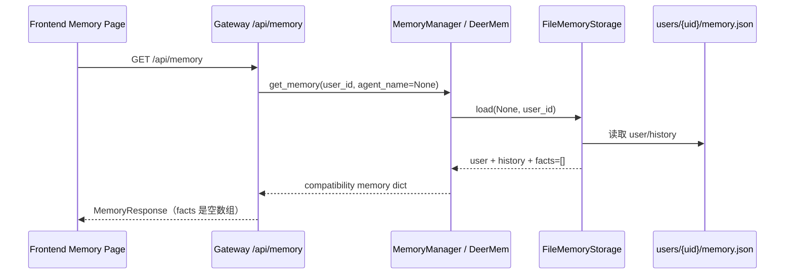
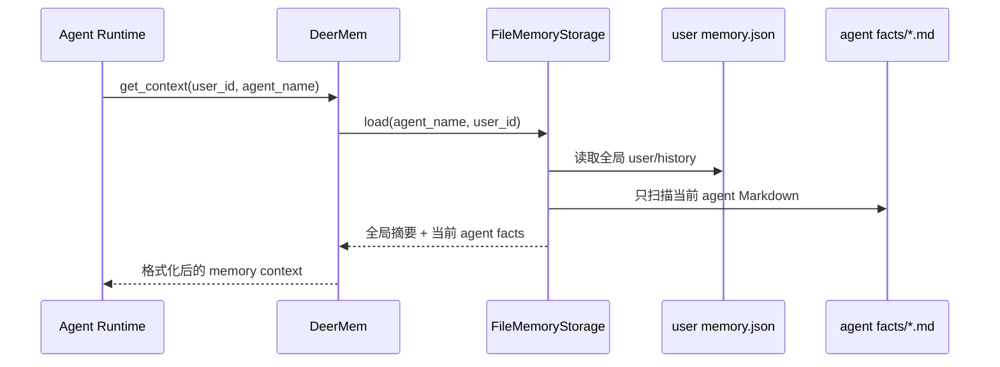
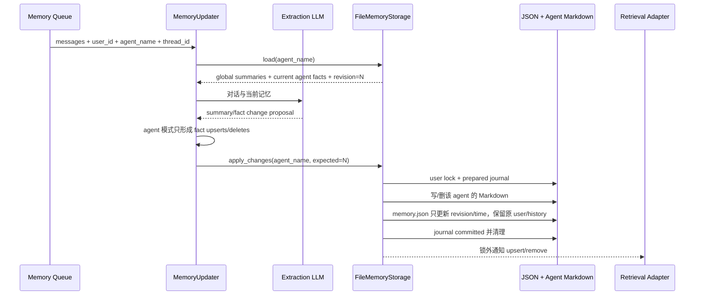

# DeerMem Storage 实施说明：全局摘要 JSON + Agent Fact Markdown

> 对比基线：DeerFlow 官方 `upstream/main@bc6f1adc`<br>
> 当前分支：`factmd-memory`<br>
> 阅读对象：第一次接触 DeerFlow、Python 后端或文件存储的同学<br>
> 本文只描述代码当前真正实现的行为，不把未来的检索或 project scope 计划写成已完成。

---

## 1. 最终数据结构

本轮把“任何时候都适用的用户记忆”和“与某个 agent/项目有关的事实”彻底分开。

```text
{storage_root}/
└── users/
    └── {user_id}/
        ├── memory.json
        ├── .memory.lock
        ├── .memory.journal.json          # 仅在提交或异常恢复期间出现
        ├── .recovery/                    # 仅在提交或异常恢复期间出现
        └── agents/
            ├── {agent_name_a}/
            │   └── facts/
            │       └── {fact_id前两位}/
            │           ├── fact_1.md
            │           └── fact_2.md
            └── {agent_name_b}/
                └── facts/
                    └── {fact_id前两位}/
                        └── fact_3.md
```

其中：

- `memory.json` 只保存 `user` 和 `history` 两部分，以及文件版本、共享 revision 和更新时间。
- `memory.json` 中没有 `facts`，也没有 fact 路径、hash 或索引。
- 每一条 fact 都必须有非空 `agent_name`，并保存到该 agent 的目录。
- 不存在 per-agent `memory.json`。
- `thread_id` 只保存在 fact 的 `source.threadId`，不参与目录分桶。
- `project_id` 没有加入本次实现。

用用户给出的简化模型表示就是：

```text
user_id
├── memory.json              # user + history
└── agent_name
    ├── fact1.md
    ├── fact2.md
    └── fact3.md
```

实际代码多保留了 `agents/`、`facts/` 和 fact ID 前两位分片目录，目的是避免不同类型文件混在一起，以及避免几万条 fact 堆在同一目录。

---

## 2. 为什么这样拆分

### 2.1 `memory.json` 的含义

它只表示“属于用户本人、与当前项目无关、任何时候都可能有用”的记忆，例如：

- 用户喜欢先看结论；
- 用户常用中文交流；
- 用户的长期职业背景；
- 用户过去几个月的长期状态。

这些内容对应现有结构中的：

```text
user.workContext
user.personalContext
user.topOfMind
history.recentMonths
history.earlierContext
history.longTermBackground
```

### 2.2 Agent facts 的含义

每条 Markdown fact 表示某个 agent 工作范围内的事实，例如：

- research-agent 项目使用 Python 3.12；
- deploy-agent 的目标环境是 Kubernetes；
- thesis-agent 当前实验不能修改 baseline 参数。

这些 facts 将来可由检索模块在用户主动提起或进入对应 agent/项目时召回。本分支只负责正确存储和按 agent 精确读取，不负责决定何时召回、如何排序或如何注入 prompt。

### 2.3 为什么 JSON 不再保存 fact 目录

如果 JSON 仍保存 fact ID、路径或 hash，它仍然是 fact manifest；删除、移动或直接索引 Markdown 时必须同步两份结构。现在 agent facts 可以通过目录扫描得到，Markdown 自身包含完整 metadata，因此不需要 JSON 再保存一份 fact 清单。

---

## 3. 磁盘文件示例

## 3.1 `memory.json`

```json
{
  "version": "2.0",
  "revision": 7,
  "lastUpdated": "2026-07-17T08:00:00Z",
  "user": {
    "workContext": {
      "summary": "用户负责 DeerFlow 记忆插件的 storage 改造",
      "updatedAt": "2026-07-17T08:00:00Z"
    },
    "personalContext": {
      "summary": "用户希望先用通俗语言解释专业代码",
      "updatedAt": "2026-07-17T08:00:00Z"
    },
    "topOfMind": {
      "summary": "当前关注记忆隔离和检索接入",
      "updatedAt": "2026-07-17T08:00:00Z"
    }
  },
  "history": {
    "recentMonths": {"summary": "", "updatedAt": ""},
    "earlierContext": {"summary": "", "updatedAt": ""},
    "longTermBackground": {"summary": "", "updatedAt": ""}
  }
}
```

请特别注意：这里没有 `facts` 字段。

## 3.2 Agent fact Markdown

路径示例：

```text
users/alice/agents/research-agent/facts/fa/fact_123456.md
```

内容示例：

```markdown
---
id: fact_123456
schemaVersion: 2
category: constraint
topics:
  - python
  - runtime
confidence: 0.95
status: active
createdAt: '2026-07-17T08:00:00Z'
updatedAt: '2026-07-17T08:00:00Z'
revision: 1
source:
  type: conversation
  threadId: thread_789
user_id: alice
agent_name: research-agent
consolidatedFrom: []
---

# 项目运行时约束

项目使用 Python 3.12。
```

YAML 保存结构字段，一级标题供人阅读，正文保存原子事实。

---

## 4. 前端兼容是怎样做的

前端没有直接打开磁盘上的 `memory.json`。实际调用链是：

```text
Frontend
→ GET /api/memory
→ Gateway memory router
→ get_memory_manager()
→ DeerMem.get_memory(user_id, agent_name=None)
→ FileMemoryStorage.load(agent_name=None)
```

前端当前的 TypeScript 类型仍强制要求：

```ts
facts: MemoryFact[]
```

因此磁盘格式和 API 格式故意不同：

| 位置 | `facts` 行为 |
|---|---|
| 磁盘 `memory.json` | 完全没有 `facts` 字段 |
| `storage.load(agent_name=None)` | 在返回的 Python dict 中补 `facts: []` |
| `/api/memory` | 返回 `facts: []`，前端不会因缺字段报错 |
| `storage.load(agent_name="research-agent")` | 返回该 agent 目录中解析出的 facts |

这叫兼容视图：不为了兼容前端而污染磁盘结构，只在运行时返回旧调用者需要的形状。

当前全局 Memory 设置页不会展示任何 agent facts。它只会看到全局摘要和空 fact 列表。为 agent facts 设计新的前端选择/管理入口不属于本次工作。

---

## 5. 各文件改动和理由

## 5.1 `core/paths.py`

### `memory_file_path()`

修改前：

```text
user + agent → users/{uid}/agents/{agent}/memory.json
user only    → users/{uid}/memory.json
```

修改后：

```text
无论是否传 agent_name → users/{uid}/memory.json
```

传入 `agent_name` 时仍会执行安全校验，但它不再改变 JSON 路径。

### `agent_facts_directory()`

新增函数，统一生成：

```text
memory.json 所在用户目录/agents/{agent_name}/facts
```

### `fact_file_path()`

现在强制要求 keyword-only 的 `agent_name`：

```python
fact_file_path(memory_path, fact_id, agent_name="research-agent")
```

fact ID 只允许字母、数字、下划线和连字符，并用前两位分片。

## 5.2 `core/storage.py`

### 文件职责

`FileMemoryStorage` 现在同时维护：

1. 用户级全局摘要 JSON；
2. 一个或多个 agent 的 Markdown fact 目录；
3. 兼容旧 Manager/Updater 的完整 dict 视图；
4. user 级写锁、revision 和 journal；
5. retrieval adapter 的通知和搜索委托。

### `_scope_signature()`

缓存签名由两部分组成：

- 全局 `memory.json` 的纳秒 mtime 和大小；
- 当前 agent 目录下每个 Markdown 的路径、纳秒 mtime 和大小。

因此同一个用户的摘要变化，或当前 agent 的任何 fact 文件变化，都会使对应缓存失效。

### `_load_agent_facts()`

- `agent_name=None`：直接返回空数组；
- 有 agent：扫描该 agent 的 `facts/**/*.md`；
- 逐个解析 YAML 和正文；
- 校验文件名 stem 与 fact 内部 ID 一致；
- 损坏时抛 `MemoryStorageCorruption`，不伪装成空记忆。

### `_agent_entries()`

仅在一次保存前扫描当前 agent 已有的 fact ID 和路径，用于：

- 判断哪些 fact 被删除；
- 为 journal 创建旧文件备份；
- 崩溃恢复。

这些 entries 只存在于运行内存和临时 journal，不会写进 `memory.json`。

### `_load_memory_file()`

读取用户级 JSON：

- 文件不存在表示新用户，返回 `None`；
- JSON 损坏或不是 object 时抛 corruption；
- 不再把它称作 fact manifest。

### `_document_from_memory_file()`

把磁盘数据组合成兼容对象：

```text
memory.json 的 user/history
+ 当前显式 agent 的 Markdown facts
= 上层看到的完整 memory dict
```

如果发现旧 JSON 中还有 `facts` list 或旧 fact manifest mapping，会暂时读取它们，以便迁移。

### `_legacy_agent_memory_path()` 与 `_migrate_legacy_agent_file()`

上一版或官方旧结构可能存在：

```text
users/{uid}/agents/{agent_name}/memory.json
```

首次读取该 agent 时：

1. 读取旧 per-agent JSON；
2. 解析其中的 facts；
3. 将 facts 写成该 agent 的 Markdown；
4. 全局摘要仍以用户根目录的 `memory.json` 为准；
5. 成功后删除旧 per-agent `memory.json`。

### `load()` / `reload()`

`load(agent_name=None)`：

```text
读取 users/{uid}/memory.json
→ 不扫描任何 agent 目录
→ 返回 user + history + facts=[]
```

`load(agent_name="research-agent")`：

```text
检查并迁移旧 per-agent JSON
→ 读取 users/{uid}/memory.json 的全局摘要
→ 扫描 research-agent/facts/**/*.md
→ 返回全局 user/history + research-agent facts
```

`reload()` 跳过旧缓存强制重读。

### `save()`

全局写入 `save(data, agent_name=None)`：

- 允许更新 `user/history`；
- 要求传入的 `facts` 为空；
- 磁盘 JSON 永远不写 `facts`。

Agent 写入 `save(data, agent_name="research-agent")`：

- 只写该 agent 的 Markdown facts；
- 忽略传入 data 对 `user/history` 的改变；
- 从磁盘保留当前全局摘要；
- 不会生成 per-agent JSON。

这样可以阻止某个项目对话生成的 summary 覆盖用户全局记忆。

两种写入都会使用户级 revision 加一。该 revision 是同一个用户所有摘要和 agent facts 的共享 optimistic revision。

### Repository API

- `get_fact/list_facts`：只有显式 agent 才能看到 facts；无 agent 返回空列表。
- `upsert_fact/delete_fact`：没有 agent 时直接 `ValueError`。
- `apply_changes`：只要包含 fact upsert/delete，就必须有 agent。
- `get_summaries`：读取用户全局摘要。
- `update_summaries`：无论调用者是否带 agent 参数，都只更新用户全局 JSON。

### Retrieval API

- fact 成功提交后，在锁外通知 adapter upsert/remove；
- `search_facts` 要求 scopes 中提供 agent，global scope 自然得到空 facts；
- 未配置 adapter 时仍用 substring fallback；
- `rebuild_index()` 扫描 `**/facts/**/*.md`，不依赖 JSON manifest。

### Capabilities

原来的 `manifest` capability 改成：

```text
global-summary-json
```

因为 `memory.json` 已经不再是 fact manifest。

## 5.3 `core/updater.py`

### 全局 import

前端导入格式仍可能带 `facts`。为了兼容旧 payload 且不污染全局 JSON：

```text
agent_name=None 的 import → 保留 user/history，丢弃 facts，正常返回
```

### 人工 fact CRUD

`create_memory_fact/delete_memory_fact/update_memory_fact` 现在要求非空 `agent_name`。没有 agent 就无法判断 fact 应属于哪个项目目录，因此不允许写入共享位置。

### LLM 后台更新

当 `agent_name=None`：

- Updater 仍可更新全局 `user/history`；
- 即使 LLM 提议新增 fact，也不会把它写到全局 JSON。

当 `agent_name` 非空：

- Updater 生成 fact upserts/deletes；
- storage 将它们写入对应 agent；
- change set 中的 summary 变化不会覆盖全局摘要。

## 5.4 `deer_mem.py`

搜索仍通过 `MemoryManager` 实现类 DeerMem：

- 精确把 `userId + agentName` 传给 storage/retrieval；
- 没 agent 的全局搜索不会扫描所有 agent；
- 有 agent 才搜索该 agent facts。

## 5.5 `gateway/routers/memory.py`

Gateway 没有直接调用 storage，也没有导入 DeerMem 私有路径。它仍然只调用：

```python
get_memory_manager()
```

`MemoryResponse.facts` 使用 `default_factory=list`。因此 storage 的全局兼容对象和其他缺省 backend 都能返回前端需要的空数组。

本轮没有为前端新增 agent 选择参数；这属于后续 agent fact 管理/召回入口设计。

## 5.6 配置与开发文档

- `manifest_filename` 配置名为兼容已有配置暂不重命名，但注释已明确它现在是“用户全局摘要 JSON 文件名”。
- `README.md`、`backend/AGENTS.md`、`config.example.yaml` 均改为新结构。
- `STORAGE_REWRITE_PLAN.md` 已同步撤销 JSON fact manifest 设计。

---

## 6. 完整运行轨迹

## 6.1 前端读取全局记忆



## 6.2 自定义 agent 读取上下文



这符合“项目内召回”：进入哪个 agent，只能获得该 agent 的项目 facts，同时仍能获得全局用户偏好。

## 6.3 Agent 对话产生新 fact



## 6.4 Global 对话更新摘要

```text
agent_name=None
→ load 只得到全局摘要和空 facts
→ LLM 可提出 user/history 更新
→ Updater 丢弃无 owner 的 fact proposals
→ storage 只写 memory.json
```

## 6.5 并发写入

虽然 facts 分属不同 agent，所有操作仍共享用户根目录的 `.memory.lock` 和 revision：

```text
Agent A 读 revision 5
Agent B 读 revision 5
Agent A 先写成功 → revision 6
Agent B 获得锁后发现 expected 5 != current 6
Agent B 被拒绝，不能覆盖 A
```

这样实现最简单、最安全，但不同 agent 的写入也会互相竞争。未来若性能成为问题，可把 revision 拆成全局 summary revision 与每 agent fact revision。

## 6.6 崩溃恢复

写入前 journal 记录：

- operation ID；
- 当前 agentName；
- expected/next revision；
- 本次 fact IDs；
- 旧 fact 相对路径；
- recovery 目录中的旧 JSON 和旧 Markdown 快照。

恢复规则：

| journal 状态 | 行为 |
|---|---|
| `prepared` | 恢复旧 `memory.json` 和旧 facts，删除本次新增 facts |
| `committed` | 保留新数据，只清理 journal/recovery |
| 未知/损坏 | 抛 corruption，停止自动覆盖 |

---

## 7. 测试覆盖

新增或调整的测试证明：

1. 同一用户只有一个 `memory.json`。
2. JSON 顶层只有 `version/revision/lastUpdated/user/history`。
3. 不同 agent facts 进入不同目录。
4. global load 返回 `facts=[]`，显式 agent load 才返回 facts。
5. agent save 不能覆盖全局摘要。
6. fact 删除会物理删除 Markdown。
7. 缓存返回深拷贝。
8. JSON 损坏不会被当成空记忆。
9. stale revision 写入会被拒绝。
10. retrieval 收到带 agent scope 的生命周期通知。
11. prepared journal 可以恢复旧 JSON 和 fact。
12. repository upsert/delete 要求 agent_name。
13. substring fallback 只搜索指定 agent。
14. strict user scope 与自定义 JSON 文件名仍生效。
15. 用户根目录旧 JSON facts 能迁移到指定 agent。
16. 旧 per-agent `memory.json` 首次读取后迁移并删除。
17. 前端/API 所依赖的兼容 dict 仍包含 facts 数组。

---

## 8. 当前限制和后续边界

### 8.1 未传 agent_name 的 fact 不会保存

这是有意的 fail-closed 行为。storage 不会猜测一个默认项目，也不会把它放进用户共享 JSON。

### 8.2 前端没有 agent fact 管理入口

全局设置页只读全局摘要和空 facts。现有全局 fact 新增/编辑按钮没有 agent owner 语义，后续应在前端明确 agent 后再调用 CRUD，而不是由 storage 猜测。

### 8.3 摘要的“项目无关”仍依赖上游提取质量

结构保证 agent 写入不能覆盖 global summaries；但 global/lead-agent 对话产生的摘要是否真的项目无关，还需要 prompt、分类或人工管理策略配合。

### 8.4 没有 fact manifest/hash

这是本次明确选择。目录是 fact 枚举来源，Markdown 是唯一事实源。直接手工编辑 Markdown 会被下一次扫描读取；格式损坏会报错。若需要防篡改，可将 hash 放进独立审计/索引 sidecar，而不是重新塞回 `memory.json`。

### 8.5 File backend 不是数据库

列举 facts 需要扫描当前 agent 目录；共享 user revision 会让不同 agent 写入竞争。SQLite/Postgres 仍可在未来通过 repository API 接入。

### 8.6 检索与主动召回不在本 PR

storage 只提供精确 agent scope、Markdown 数据源和 adapter API。用户主动提起时如何触发检索、项目内何时召回、如何排序和注入，由 retrieval/runtime 负责人实现。

---

## 9. 最简心智模型

```text
没有 agent_name：只读写用户全局 user/history，facts 永远为空。
有 agent_name：读取全局 user/history，但只读写这个 agent 的 Markdown facts。
```

这就是当前新结构最核心的规则。

---

## 10. 验证结果

```text
全部 memory 相关测试：340 passed, 1 skipped
Ruff lint：通过
Ruff format check：通过
git diff --check：通过
```

测试数从上一版的 337 增加到 340，是因为新增了“单 user JSON + agent facts”“agent 不覆盖 global summaries”和“旧 per-agent JSON 迁移”等场景。
